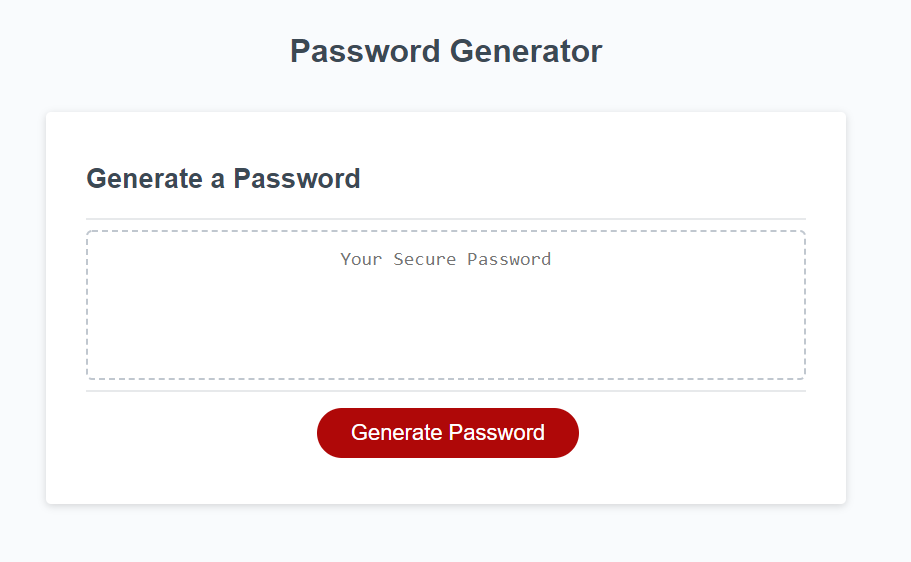

Assignment: Password Generator

Author: Tyler Fabian

GitHub: https://github.com/tylerf808/password-generator

Live GitHub: https://tylerf808.github.io/password-generator/

Overview:
This website generates a random password for the user. It receives the users preferences and makes a randomized custom password for them.

Instructions:
1. The user presses a "Generate Password" button and is prompted to input the desired length of the password, between 8 and 128 characters.

2. They are then prompted to confirm wether or not they would like lowercase characters.

3. Step 2 is repeated for uppercase letters, numbers, and special characters.

4. The website then displays the generated password.

